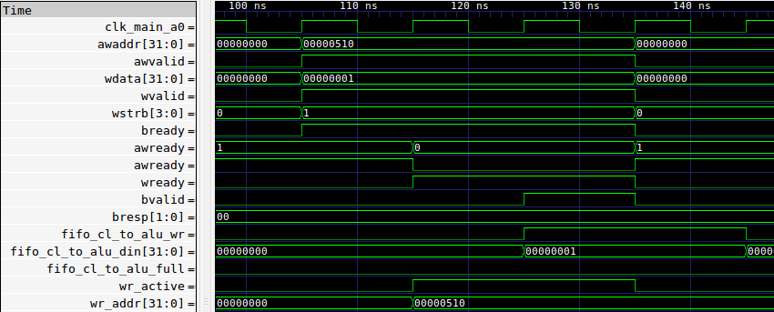
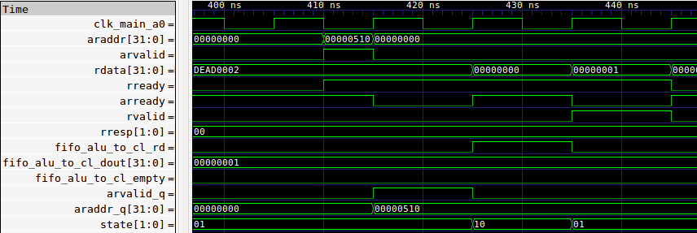

# ALU Demo

This repository is a demonstration of a Verilog ALU and supporting modules, taken from another project. The AXI and FIFO modules allow the ALU to run as custom logic on an Amazon EC2 F1 instance.

The three modules are:
* axi4lite\_to\_fifos.v
* fifo.v
* alu.v

The operation of the modules can be seen by running `make all` in the axi\_fifo\_alu\_tb directory.

The AXI4-Lite module provides an interface for Amazon's PCIe connection to communicate with the FIFOs, allowing the host server to send commands and input data to the ALU, and in turn receive output data from the ALU.

A successful AXI write transaction is seen below:

A successful AXI read transaction is seen below:

The FIFO modules provide a buffer between the AXI interface and the ALU, to allow the ALU to properly read input and write output. In operation, two FIFOs are instantiated, one for data to the ALU and one for data from the ALU.

The ALU module is a simple ALU that takes an opcode and three arguments. It supports addition and multiplication, as well as a third operation that was added as an exercise, "MUL\_ADD," that adds the third argument to the product of the first and second argument. 
